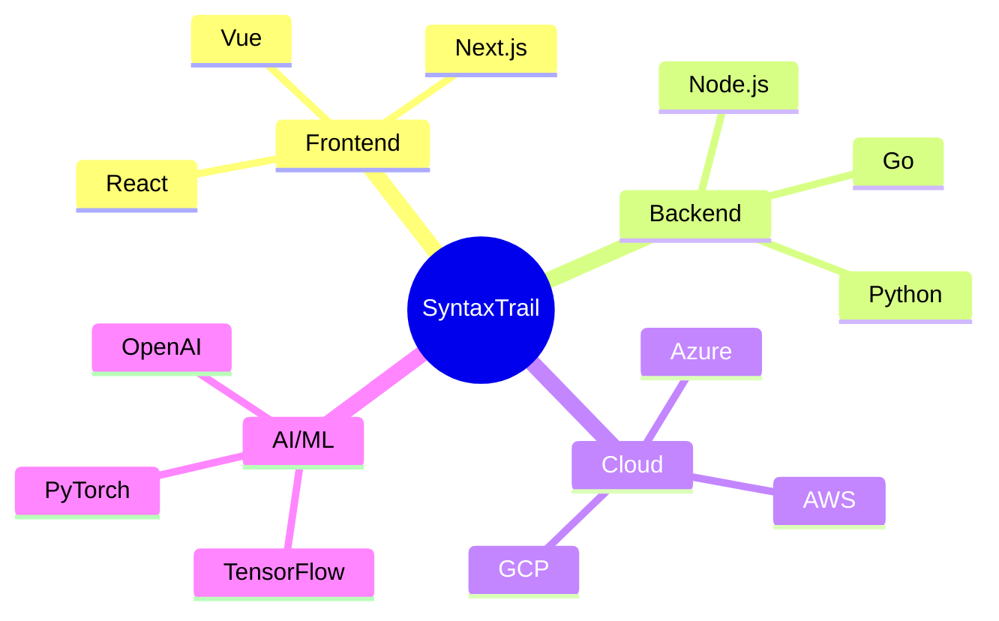

<div align="center">
  
# 🚀 Welcome to SyntaxTrail

[](https://github.com/SyntaxTrail)
[](https://twitter.com/SyntaxTrail)

*Where Code Meets Innovation* 

[Website](https://syntaxtrail.dev) • [Blog](https://blog.syntaxtrail.dev) • [Community](https://discord.gg/syntaxtrail)

</div>

---

## 💫 About Us

We're a collective of passionate developers building the future through code. SyntaxTrail is where innovation meets implementation, where ideas transform into reality, and where developers come together to create extraordinary solutions.

## 🎯 Our Mission

To democratize technology by creating open-source solutions that matter. We believe in:

- Building sustainable and scalable solutions
- Fostering an inclusive developer community
- Pushing the boundaries of what's possible with code
- Sharing knowledge and empowering others

## 🌟 Featured Projects

### 🔮 Quantum Code
Revolutionary code analysis tool using AI
```typescript
future.is.now();
```

### 🎨 PixelPerfect
Design system for the modern web
```css
.future { display: innovation; }
```

### 🚀 ServerlessStack
Cloud infrastructure made simple
```python
cloud.deploy(future='now')
```

## 🛠️ Technologies We Love



## 🌱 Join Our Community

We're always looking for passionate developers to join our mission. Here's how you can get involved:

- 🌟 Star our repositories
- 🔄 Fork and contribute
- 💡 Share your ideas
- 🤝 Join our Discord community

## 📈 Our Impact

```
Contributors: 0
Open Source Projects: 0
GitHub Stars: 0
Discord Members: 0
```

## 🎨 Design Philosophy

We believe in creating elegant, efficient, and accessible solutions. Our code is:

- 🎯 Purpose-driven
- 🧩 Modular
- 🔄 Maintainable
- 🌍 Globally accessible

## 📞 Connect With Us

<div align="center">

[](https://github.com/SyntaxTrail)
[](https://discord.gg/syntaxtrail)
[](https://twitter.com/SyntaxTrail)
[](https://linkedin.com/company/syntaxtrail)

</div>

---

<div align="center">

### 🌟 "Code is poetry, let's write something beautiful together" 🌟

*Made with ❤️ by the SyntaxTrail Team*

</div>
